# 🦢 gooseBot: AI-Powered Game Automation for Goose Goose Duck

An advanced AI agent for social deduction games (like Goose Goose Duck) built with **YOLOv8/v11**, **EasyOCR**, and **TensorRT**. This project combines high-performance vision with player tracking and character color recognition.

---

## 🚀 Key Features

*   **High-Performance Detection**: Optimized for **GPU** using TensorRT (`.engine`) and FP16 half-precision for maximum FPS.
*   **Player Tracking**: Persistent ID assignment to track individual players as they move across the screen.
*   **Dynamic Room Recognition**: Integrated **EasyOCR** (GPU-accelerated) to read room names and game states (e.g., "MEETING", "VOTING", "IDLE").
*   **Color Identification**: Advanced character color detection using HSV color space to distinguish players (Red, Blue, Green, etc.).
*   **Self-Learning Loop**: Automatic data collection during "low-confidence" scenarios for model retraining.
*   **LLM Brain Integration**: A modular interface for **Ollama (Llama 3)** to process vision data and make strategic decisions.

---

## 🛠️ Tech Stack

*   **Computer Vision**: `ultralytics` (YOLOv8/v11), `OpenCV`
*   **Performance**: `TensorRT`, `PyTorch` (CUDA enabled)
*   **OCR**: `EasyOCR`
*   **Capture**: `mss` (multi-screen capture)
*   **Annotation**: **Label Studio** (JSON export format)
*   **Brain/LLM**: `Ollama`, `requests`

---

## 📂 Model Retraining Workflow

Follow these steps to retrain your YOLO model with new gameplay data using your **GPU**.

### 1. Data Collection & Annotation
*   **Collect**: Run `test.py` to capture raw frames in the `retrain_data` folder.
*   **Annotate**: Import images into **Label Studio**. Tag the four classes: `dead_body`, `goose`, `interact_button`, and `report_button`.
*   **Export**: Export your project from Label Studio in **YOLO format**.

### 2. Dataset Organization
Place your images in `all_images` and exported labels in `all_labels`. Then, run the organization script:
```powershell
.\venv\Scripts\python src/actions/organize_data.py
```
*This splits your data into `train` and `val` sets inside `training/dataset_final/`.*

### 3. Training the Model
Ensure `training/data_final.yaml` has the correct path, then start the training:
```powershell
.\venv\Scripts\python src/actions/final_train.py
```
*Weights and results will be saved in `runs/detect/goose_final_model/`.*

### 4. Optimization (TensorRT)
To maintain high FPS on your GPU, convert the new `best.pt` back to a TensorRT engine:
```powershell
.\venv\Scripts\python src/actions/export_engine.py
```
*Update `config/settings.yaml` to point to the new `.engine` file.*


## Some of result image:


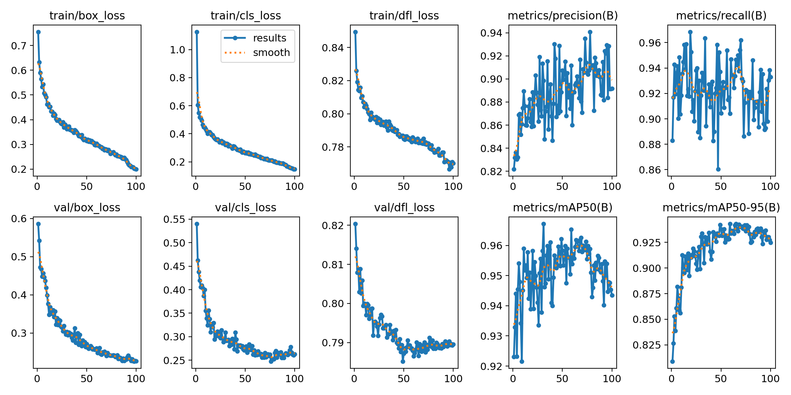
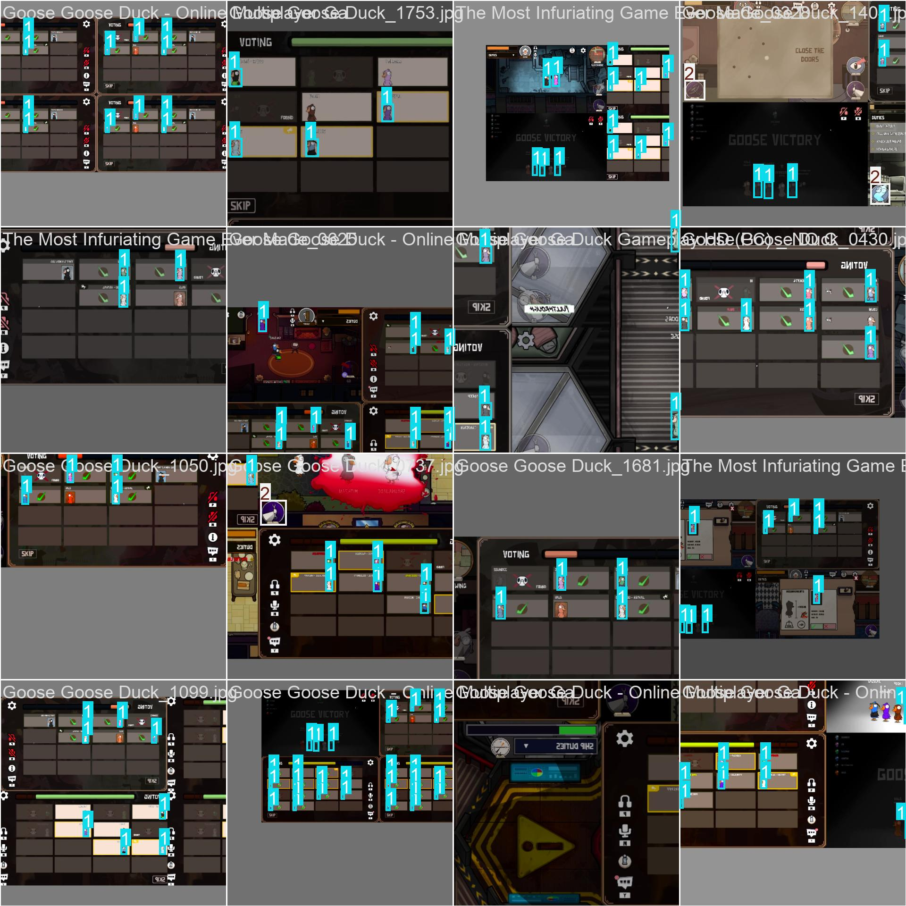
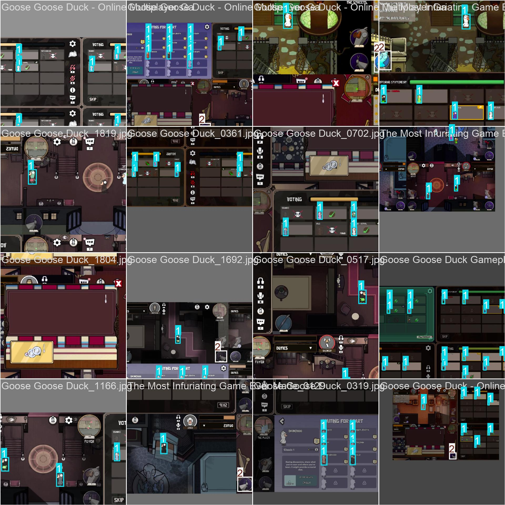
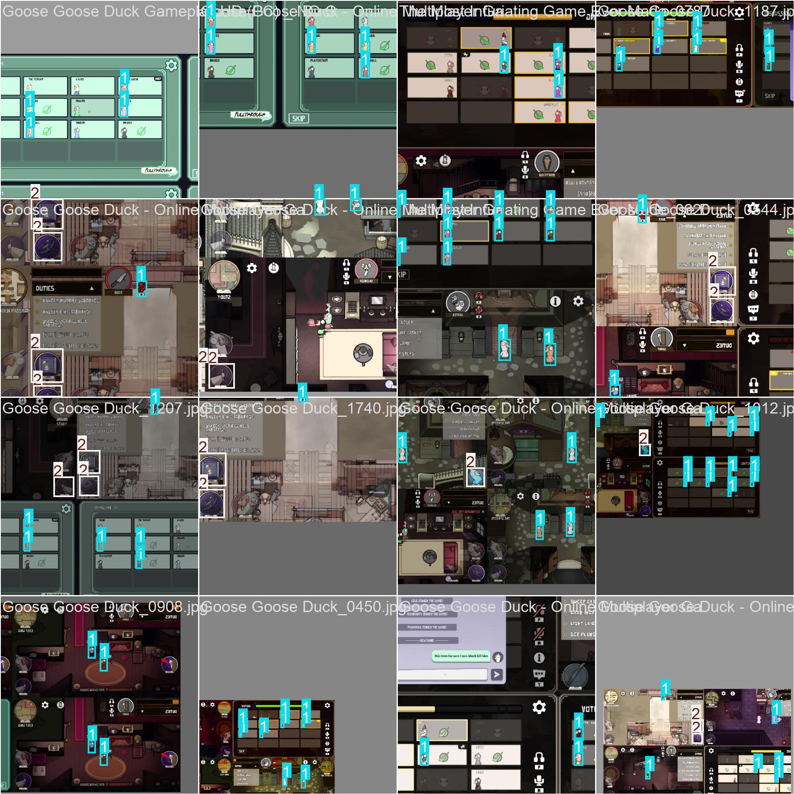
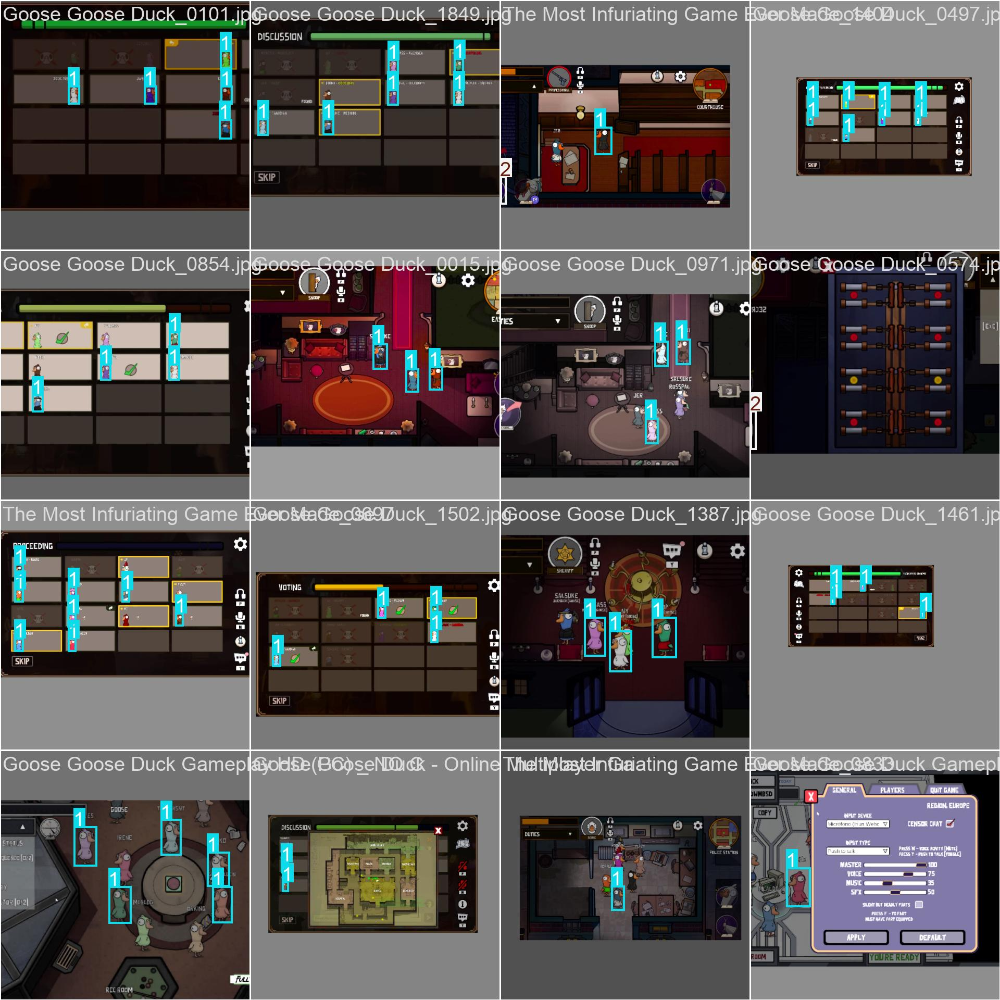 
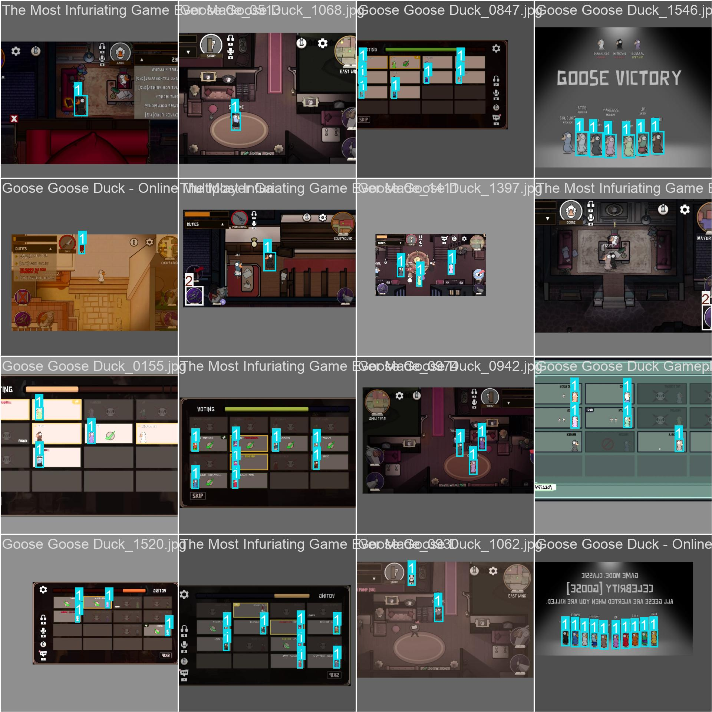 
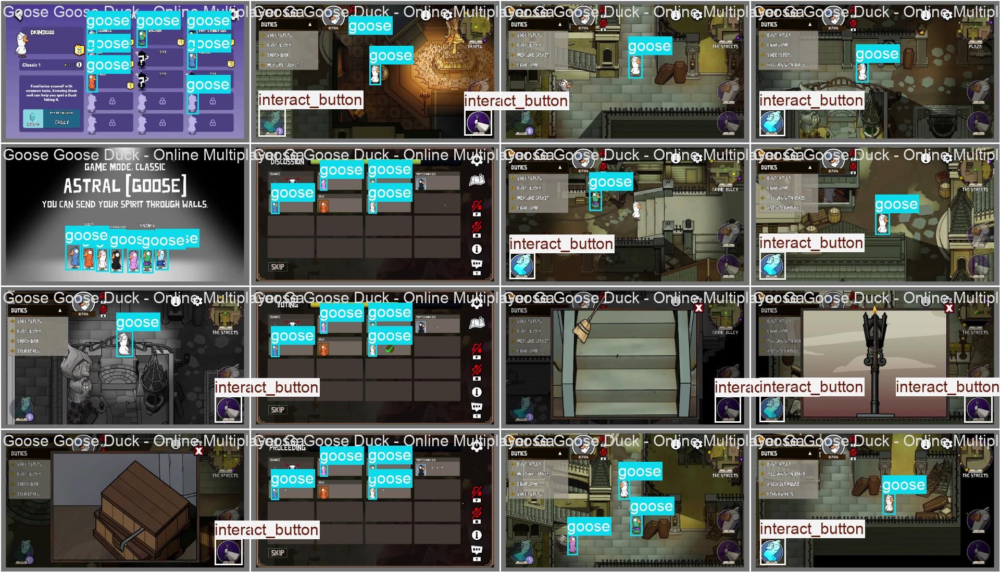 
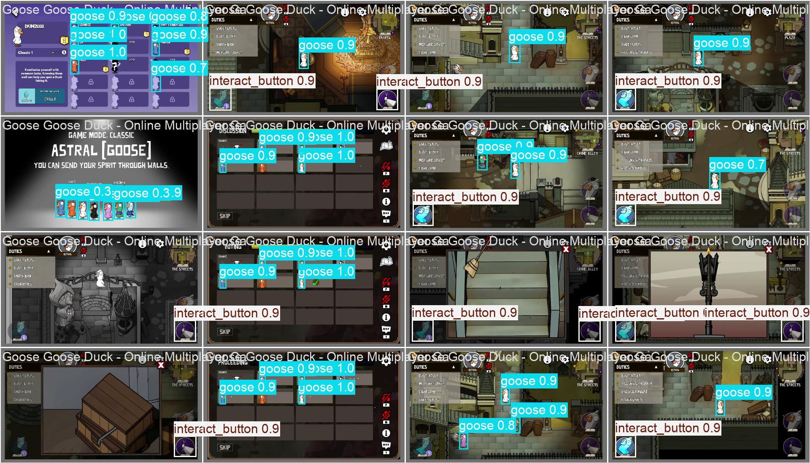 
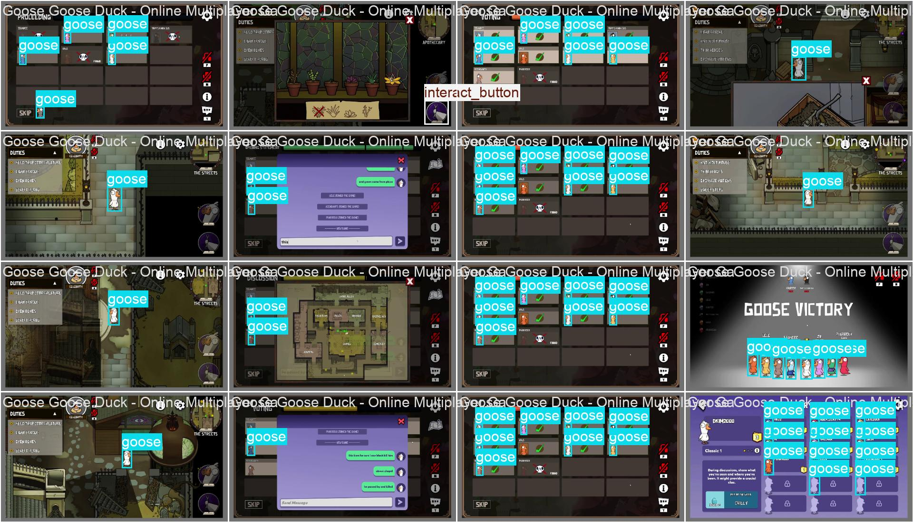 
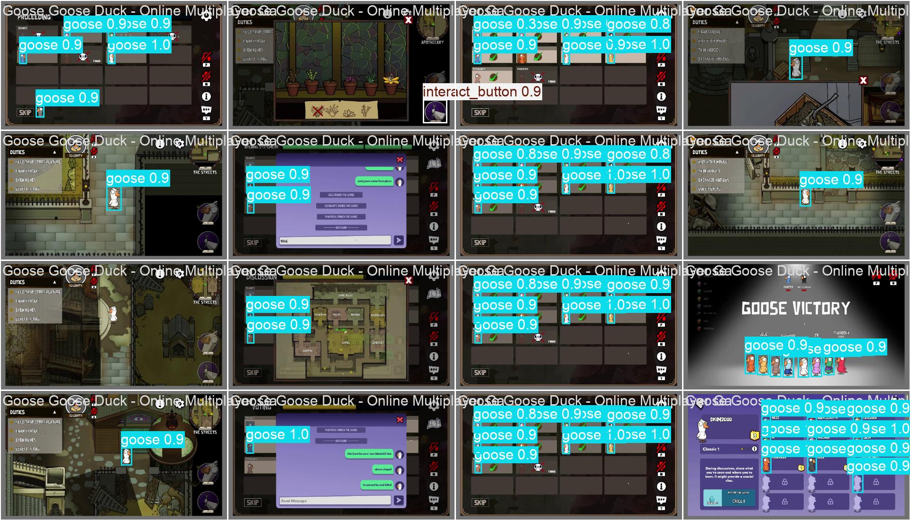 
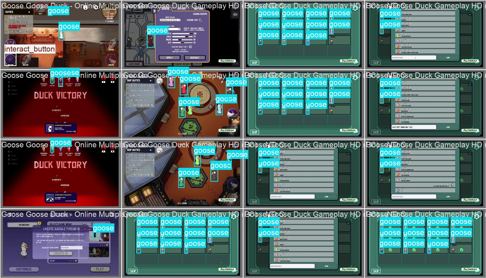 
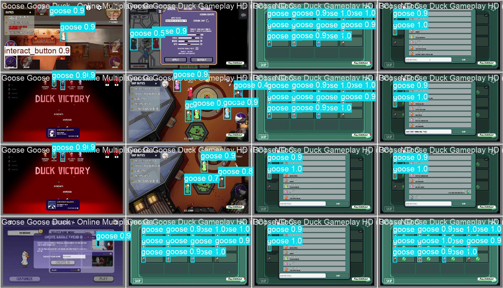 
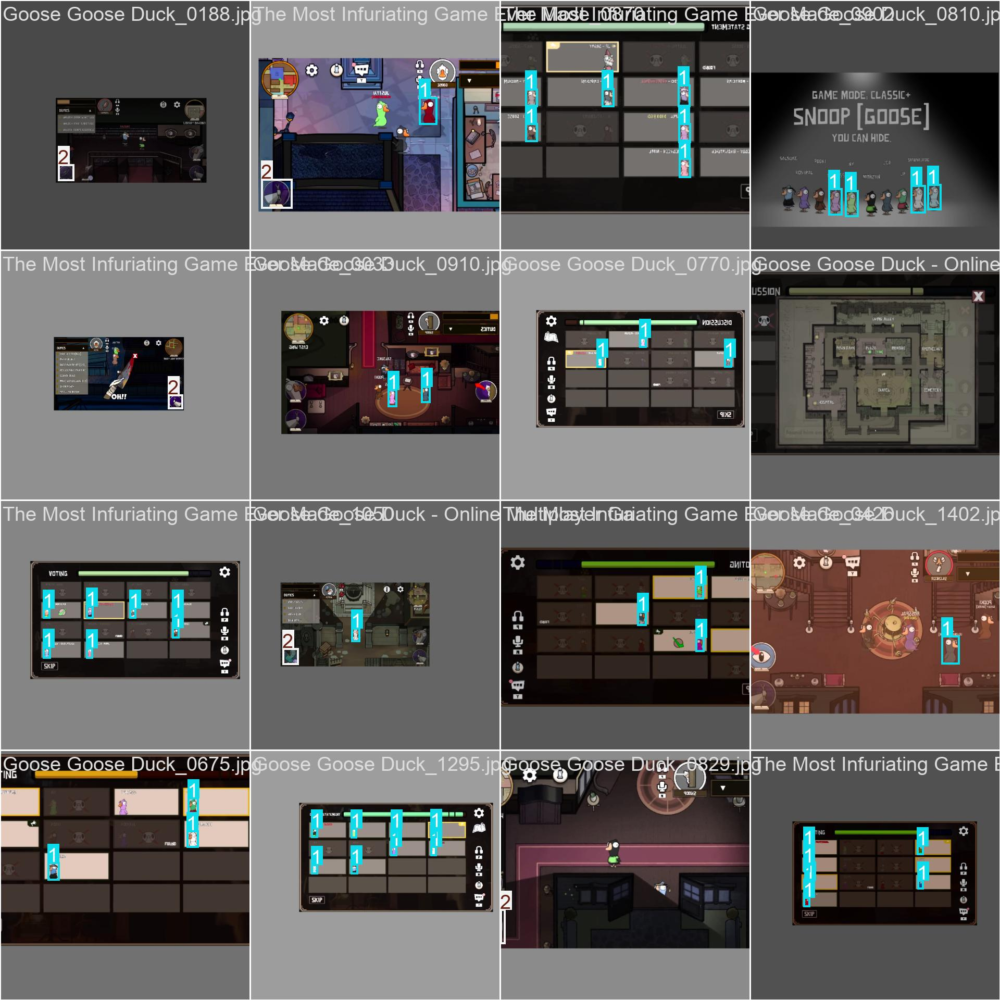


## ⚙️ Setup & Installation

### 1. Create Environment
```bash
python -m venv venv
.\venv\Scripts\activate
pip install -r requirements.txt
```

### 2. Configure PyTorch for RTX GPU (CUDA)
To utilize your **GPU**, manually install the CUDA-enabled version of Torch:
```bash
pip uninstall torch torchvision torchaudio -y
pip install torch torchvision torchaudio --index-url https://download.pytorch.org/whl/cu12x (base on your GPU, you should visit there main page)
```

### 3. Running the Bot
```bash
# To run the full tracker with Room OCR and State Detection:
python src/vision/detector.py

There will be three times, one is for the window capture the game, two for capturing place that holds the name room, last is for capturing the stage when the player in the meeting.

# To run a simple vision test:
python test.py
```

---

## 📈 Current Project Status
- [x] YOLO Model Training (4 classes)
- [x] GPU-Accelerated Player Tracking
- [x] EasyOCR Room Recognition
- [x] TensorRT Exporting Workflow
- [ ] Full Integration with Ollama/Llama 3 (In Progress)
